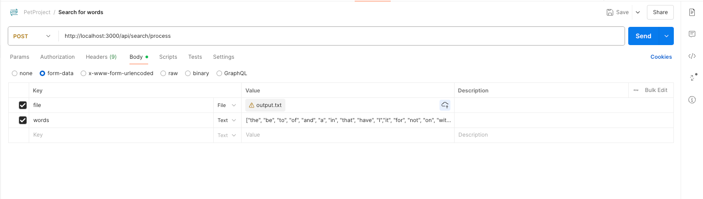
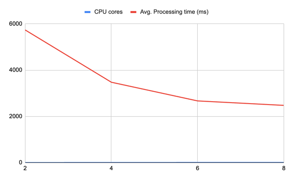

# 🔍 go-search

## Usage

```shell
git clone https://github.com/KHYehor/go-search.git
cd go-search
docker-compose up --build

curl -X POST http://localhost:3000/api/search/process \
  -F "file=@./samples/large.txt" \
  -F 'words=["hello","world"]'
```

but I suggest using postman collection `/docs/postman` like at the image:



## 📓 Description

`go-search` is a pet project practice for self-development and improving skills.

This is a high-performance text search engine written in Go, optimized for processing large files with efficient memory usage and parallel processing. 

It allows you to upload a file and search for multiple keywords giving as output array of coordinates `[line_number, column_number]`. The result is saved to the mongo DB and file system (docker volume). Saving to mongo can fail due to its limits in 16MB per document.

---

## 🏗️ Architecture

The system is built with the following key components:

- **Gin Web Framework** – lightweight HTTP server with middleware support.
- **Buffered File Scanner** – optimized file reading with large buffer size (1MB+ per line).
- **Sharded Concurrent Indexer** – search logic split across CPU cores using goroutines and channels.
- **JSON API** – accepts POST requests with file + keywords, returns search results.
- **Jobs Manager** – handles background task execution with request tracking.

---

## ⚙️ Features

### 1. Using sync.Pool to optimize memory allocation and releasing. 

```go
buffer: &sync.Pool{
	New: func() any {
		return &Input{}
    },
},

...

// Getting
in := idx.buffer.Get().(*Input)

...

// Release memory to the buffer pool
sh.buffer.Put(input)
```

### 2. Using workers + channels to achieve balanced concurrent calculations.

```go
var wg sync.WaitGroup
wg.Add(CpuNum)
for i := 0; i < CpuNum; i++ {
	go idx.shards[i].worker(&wg, idx.words)
}
```

### 3. Using runes gives a possibility to work with not only ASCII character but also with speacial symbols

```go
idx.words = make([][]rune, len(words))
for i, word := range words {
	idx.words[i] = []rune(word)
}
```

---

## 📋 Results

### 📊 Performance Benchmarks

Performance measured at Mac M1 for 150MB of txt file and 10 words. It can be noticed, tha the CPU growth improve the performance. 

| CPU cores | Avg. Time (ms) | Time1 | Time2 | Time3 | Time4 | Time5 |
|-----------|---------------------------|-------|-------|-------|-------|-------|
| 8         | 2475.4                    | 2608  | 2335  | 2588  | 2368  | 2478  |
| 6         | 2668.4                    | 2636  | 2649  | 2633  | 2705  | 2719  |
| 4         | 3476.6                    | 3536  | 3482  | 3481  | 3380  | 3504  |
| 2         | 5738.8                    | 5824  | 5700  | 5698  | 5784  | 5688  |




One more experiment of searching 30 words in 150MB file showed the next:

| CPU cores | Time1 | Time2 |
|-----------|-------|-------|
| 8         | 6800  | 7500  | 
| 24        | 2200  | 2500  |

The same task was ran at two different PC and the difference is equal to the number of CPUs. 

---

## 📈 Future Improvements

1. Extend infrastructure to make it as a streaming service. Due to processing all at once, the RAM consumes too much memory and count can grow dramatically. It is unacceptable and should be changed.

2. Analyze memory allocation. From my observation,  bytes.growSlice takes too much and GC can not always immediately return it back to OS or to Free memory Heap, forcing calling garbage collector directly.

3. Provide unit tests.

